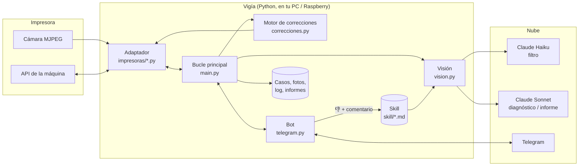
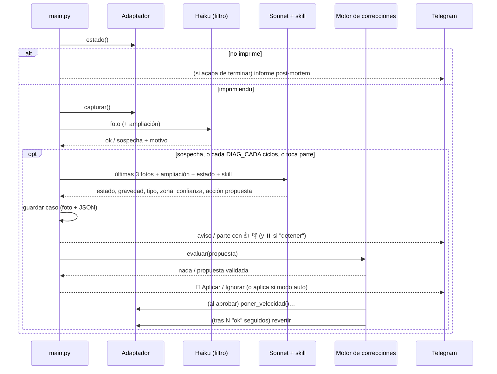

# Arquitectura

## La idea en una frase
Un **vigía barato** mira la impresora cada pocos segundos; cuando ve algo raro, despierta
a un **experto** (Claude con una skill) que diagnostica. El experto **propone** y unas
**reglas fijas en código deciden** si se toca la impresora. Tú supervisas todo por Telegram.

## Vista general

## Capas

| Capa | Ficheros | Responsabilidad | Depende de la impresora |
|---|---|---|---|
| **Adaptador** | `vigia/impresoras/*.py` | Hablar con la máquina: estado, foto, ajustes, pausa | **Sí** (uno por familia) |
| **Visión** | `vigia/vision.py` | Filtro rápido, diagnóstico, preguntas libres, informe, coste | No |
| **Conocimiento** | `skill/*.md` | Criterios, materiales, correcciones permitidas, aprendizajes | No (la máquina la describe el adaptador) |
| **Decisión** | `vigia/correcciones.py` | Convertir una propuesta de Claude en una acción segura (o descartarla) | No |
| **Interfaz** | `vigia/telegram.py` | Avisos, botones, órdenes | No |
| **Orquestación** | `vigia/main.py` | Bucle, registro de casos, informes, gestión de botones y órdenes | No |
| **Configuración** | `vigia/config.py`, `.env` | Parámetros y precios | No |

## Un ciclo de vigilancia (cada `INTERVALO_S`)

## Decisiones de diseño (y por qué)

1. **Dos niveles de IA.** El filtro (Haiku) es barato y corre cada ciclo; el diagnóstico
   (Sonnet) es más caro y solo se ejecuta cuando hace falta. Así el coste por hora es bajo
   sin perder criterio. Ver [COSTES.md](COSTES.md).
2. **La IA propone, el código decide.** Claude nunca envía comandos a la impresora. Elige
   una acción de una lista blanca; `correcciones.py` aplica límites por material, exige que
   la propuesta se repita, limita el número de cambios y revierte. Un modelo que se equivoca
   no puede, por diseño, poner la boquilla a 300 °C.
3. **El conocimiento vive en Markdown, no en el código.** `skill/*.md` se relee en cada
   diagnóstico. Mejorar el criterio no requiere programar, y el feedback 👎 se añade solo a
   `aprendizajes.md`.
4. **Un adaptador por familia de impresoras.** Todo lo que depende de la máquina está en un
   fichero con un contrato pequeño. Ver [ADAPTADORES.md](ADAPTADORES.md).
5. **La máquina describe su propia cámara.** Cada adaptador aporta `DESCRIPCION`, que entra
   en el prompt: el diagnóstico sabe qué puede ver y qué no.
6. **Fallar en silencio nunca, morir tampoco.** Errores de red, cámara ocupada o respuestas
   raras se registran y el bucle sigue; si la cámara falla varias veces seguidas, avisa.

## Seguridad

- **Solo tu chat** de Telegram (`TELEGRAM_CHAT_ID`) puede dar órdenes; el resto se ignora.
- **Nunca cancela** una impresión: como mucho pausa (y solo con tu permiso, salvo
  `AUTO_PAUSA=true`).
- Correcciones con **límites duros** por material y por impresión (ver
  [MODIFICAR.md](MODIFICAR.md#4-reglas-de-corrección)).
- Credenciales solo en `.env` (excluido de git). El código no contiene datos personales.
- Las propuestas caducan a los 10 minutos o si la impresión ya no está en marcha.

## Datos que guarda (`DIR_CASOS`)

| Fichero | Contenido |
|---|---|
| `AAAAMMDD-HHMMSS.jpg` | Foto de cada diagnóstico profundo |
| `casos.jsonl` | Una línea por caso: estado de la máquina + diagnóstico completo |
| `vigia.log` | Log del programa (si arrancas con `arrancar.sh`) |
| `informes/*.md` | Informe post-mortem + registro JSON de la impresión |

Los casos etiquetados con 👍/👎 son la base para mejorar la skill (y, en el futuro, para
evaluar cambios de prompt con datos reales).
